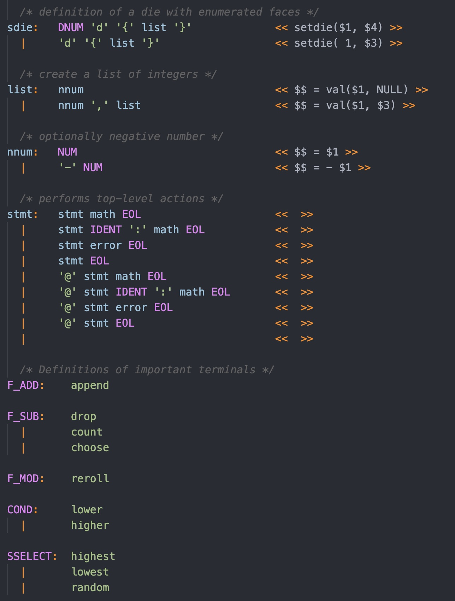

# language-grammar

A syntax highlighter for a simple grammar format inspired by Flex and Bison. Format is modelled after Flex and Bison, but EBNF conveniences are also allowed.

Recognition works on finding 2 types of productions, terminal and nonterminals. Terminals are recognized as an all capital string followed by `:`, `:=` or `::=`. Immediately afterwards until an empty line, an enumerated-like structure will be recognized. The line can start with an optional `|` and then any text afterwards is assumed to be a literal. These literals can be single quoted or not.

Nonterminals are recognized as a mix of upper and lower case characters followed by `:`, `:=` or `::=`. Immediately afterwards until an empty line, productions will be recognized. Each production can be started with a `|`. The characters `.`, `+`, `*`, `?`, `|`, `(`, `)`, `{` and `}` are recognized as grammar operators and are highlighted as such. Terminals and nonterminals will be recognized and highlighted according to their spelling. Literals are single quoted and any unquoted non-word characters are assumed to be literals.

Within terminals and nonterminals, grammar attributes can be included with `<<` and `>>` surrounding them. These rules have no syntax highlighting. Any integers are considered terminals if alone. They can be mixed with terminals and nonterminals, alongside underscores.

